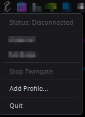

# Twingate Linux Desktop Client

> **Unofficial** - This is a community project and is not affiliated with or endorsed by Twingate Inc.

A lightweight KDE Plasma system tray application for managing Twingate VPN connections using **Service Keys** (headless authentication).

> **Note**: This application uses Twingate Service Keys for headless/unattended connections. Service Keys are JSON files provided by your Twingate admin for server/device authentication without user interaction.



## Features

- Quick profile switching from the system tray
- Connection status monitoring with duration timer
- Desktop notifications for connect/disconnect events
- Add new profiles directly from the tray menu
- Auto-start on login
- Passwordless operation (via sudoers configuration)

## Requirements

- Linux with KDE Plasma desktop
- Python 3.8+
- PyQt6
- Twingate client installed

## Supported Distributions

- Arch Linux (and derivatives: CachyOS, EndeavourOS, Manjaro)
- Debian / Ubuntu / Linux Mint
- Fedora / RHEL / CentOS
- openSUSE

## Installation

### Quick Install

```bash
git clone https://github.com/sfnemis/twingate-linux-desktop-client.git
cd twingate-linux-desktop-client
sudo ./setup.sh
```

The setup script will:
- Install Python dependencies
- Create the `/etc/twingate/keys` directory
- Install the application to `/opt/twingate-manager`
- Configure passwordless sudo for the backend script
- Create desktop and autostart entries

### Manual Installation

1. Install dependencies:
   ```bash
   # Arch
   sudo pacman -S python python-pyqt6
   
   # Debian/Ubuntu
   sudo apt install python3 python3-pyqt6
   
   # Fedora
   sudo dnf install python3 python3-qt6
   ```

2. Copy files:
   ```bash
   sudo mkdir -p /opt/twingate-manager/icons
   sudo cp twingate-tray.py /opt/twingate-manager/
   sudo cp icons/*.png /opt/twingate-manager/icons/
   sudo cp tg-switch /usr/local/bin/
   sudo chmod +x /usr/local/bin/tg-switch
   ```

3. Configure sudoers:
   ```bash
   sudo cp tg-switch.sudoers /etc/sudoers.d/twingate-manager
   sudo chmod 440 /etc/sudoers.d/twingate-manager
   ```

4. Create keys directory:
   ```bash
   sudo mkdir -p /etc/twingate/keys
   sudo chmod 755 /etc/twingate/keys
   ```

## Usage

### Starting the Application

```bash
python3 /opt/twingate-manager/twingate-tray.py
```

Or search for "Twingate Manager" in your application menu.

### Adding Profiles

1. Obtain your Twingate service key JSON file
2. Right-click the tray icon → "Add Profile..."
3. Select your JSON file
4. The profile will appear in the menu

### Switching Profiles

Right-click the tray icon and select the profile you want to connect to.

### Command-Line Usage

The backend script can also be used directly:

```bash
# Switch to a profile
sudo tg-switch profilename

# Stop Twingate
sudo tg-switch stop

# List profiles
sudo tg-switch list

# Add a new profile
sudo tg-switch add profilename /path/to/key.json
```

## File Locations

| Path | Description |
|------|-------------|
| `/opt/twingate-manager/` | Application files |
| `/usr/local/bin/tg-switch` | Backend script |
| `/etc/twingate/keys/` | Profile JSON files |
| `/etc/sudoers.d/twingate-manager` | Sudoers configuration |

## Uninstallation

```bash
sudo rm -rf /opt/twingate-manager
sudo rm /usr/local/bin/tg-switch
sudo rm /etc/sudoers.d/twingate-manager
sudo rm /usr/share/applications/twingate-manager.desktop
sudo rm /etc/xdg/autostart/twingate-manager.desktop
```

## License

MIT License - see [LICENSE](LICENSE) for details.

## Contributing

Contributions are welcome! Please open an issue or submit a pull request.
